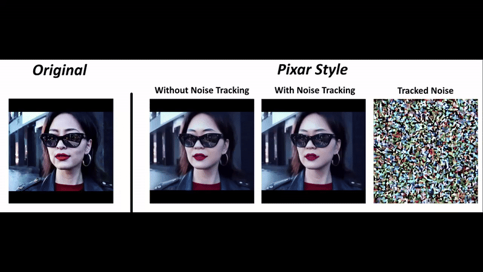

# Zero-shot Video Using Image Diffusion Models

This repository features the _Noise Crystallization_ and _Liquid Noise_ methods of creating animations using **only** Stable Diffusion v1.5 (and in theory these methods can be applied on top of any image model). The animations below were made without training any additional weights or making any video model.

This repository provides both an ipynb notebook and a Gradio-based user interface.

Note: within this repository contains code from Google's [Prompt-to-prompt repo](https://github.com/google/prompt-to-prompt), as well as a copy of the [Diffusers repo](https://github.com/huggingface/diffusers). You can include the latest version of Diffusers by installing the library, or by replacing the `/diffusers` folder with `/src/diffusers` from the original repo.

This repo was submitted as supplementary to a master's thesis for partial fulfilment of a master's degree at Imperial College London.

## Examples

Here are some example animations generated using the Zero-shot methods:

| Example | Description |
|---------|-------------|
|  | Prompt-to-video simple 2D pan using noise crystal method. |
|  | Prompt-to-video dolly parallax using noise crystal method. |
|  | Prompt-to-video landscape parallax using noise crystal method. |
|  | Prompt-to-video nature scene using liquid noise method. |
|  | Image-to-video of Adventure Time using liquid noise method. |
|  | Image-to-video using 3 image layers. |
|  | Improved video-to-video style transfer with noise tracking. |

You can find more examples in the [gallery](https://strikewind.github.io/FYP-Supplementary/).

## Installation Instructions

### Step 1: Clone the Repository

First, clone the repository to your local machine:

```sh
git clone https://github.com/Strikewind/LiquidNoise.git
cd LiquidNoise
```

### Step 2: Set Up Conda Environment

You can use Anaconda or Miniconda for this environment. All the packages required are in the provided `environment.yml` file. Follow the instructions below based on your operating system.

#### For Windows Users
1. Open Anaconda Prompt (you can find it in the Start Menu).
2. Navigate to the cloned repository directory:
```sh
cd path\to\LiquidNoise
```
3. Create the Conda environment (fyp):
```sh
conda env create -f environment.yaml
```
4. Run the Gradio UI:
```sh
run_gradioUI.bat
```
Most of the time, clicking on the file also works.

5. Go to web browser:
The default location for the UI is http://127.0.0.1:7860/. It may open automatically.

#### For Linux Users
1. Open your terminal.
2. Navigate to the cloned repository directory:
```sh
cd path/to/LiquidNoise
```
3. Create the Conda environment (fyp):
```sh
conda env create -f environment.yaml
```
4. Run the Gradio UI:
```sh
./run_gradioUI.sh
```
5. Use the web interface:
The default location for the UI is http://127.0.0.1:7860/.

### Troubleshooting
If you encounter issues with the Conda environment setup, ensure that you have either Anaconda or Miniconda installed on your system. If the conda command is not recognized, you might need to add Conda to your system's PATH.\
If your environment is installed in a non-default location, edit the batch or bash file to include your environment location.\
You may need to use `conda activate fyp` before running the UI if the wrong environment is used.

## License
This project is licensed under the MIT License. 